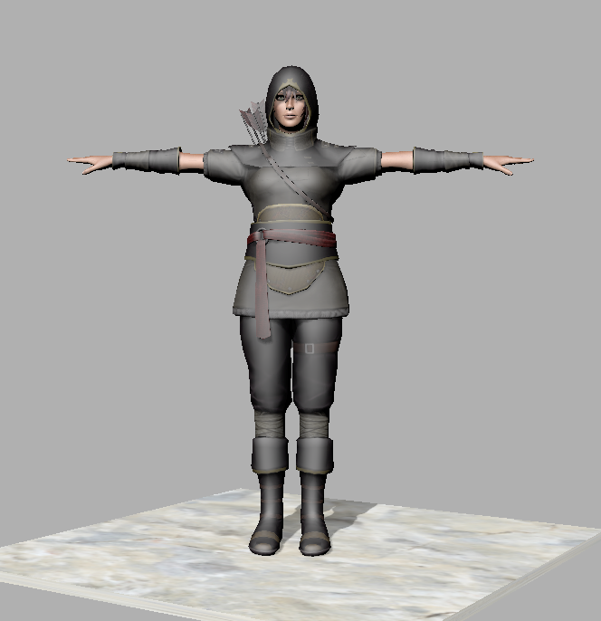

# characters-for-jme
Animated 3-D character models for use with [JMonkeyEngine][jme].

## Erika.zip

The "Erika Archer" character,
downloaded from [Mixamo] and converted using [MonkeyWrench].

26-MByte [ZIP archive](Erika.zip) containing:
+ a version-3 J3O model asset with 4 meshes, 109 animation clips, and 13025 vertices
+ 3 textures (2048 x 2048) in PNG format

## Vanguard.zip

The "Vanguard By T. Choonyung" character,
downloaded from [Mixamo] and converted using [MonkeyWrench].

11-MByte [ZIP archive](Vanguard.zip) containining:
+ a version-2 J3O model asset with 2 meshes, 82 animation clips, and 9027 vertices
+ 2 textures (1024 x 1024) in PNG format

[jme]: https://jmonkeyengine.org "jMonkeyEngine Project"
[mixamo]: https://www.mixamo.com "Mixamo.com website"
[monkeywrench]: https://github.com/stephengold/MonkeyWrench "MonkeyWrench Project"